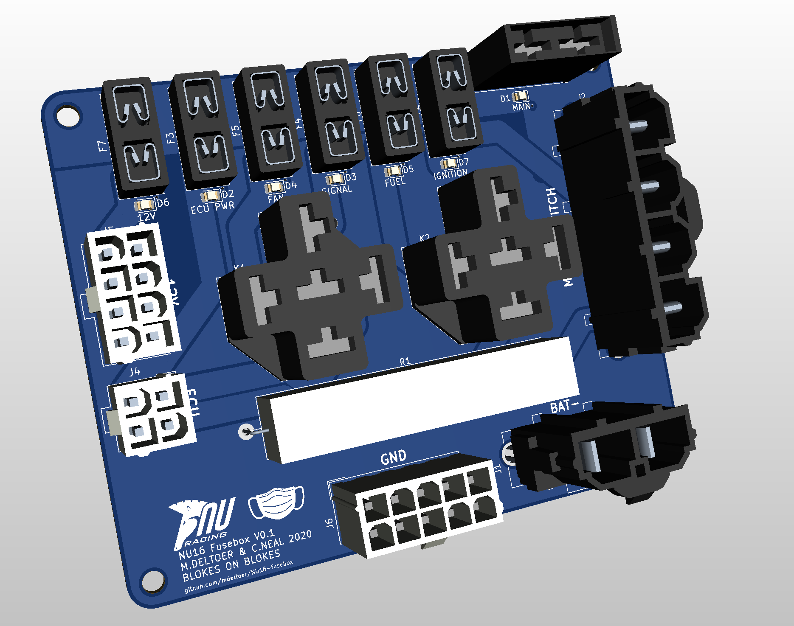
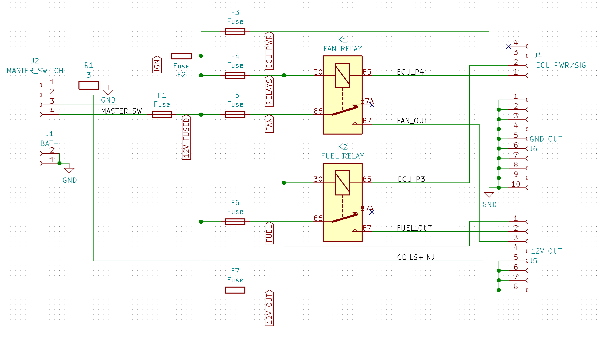
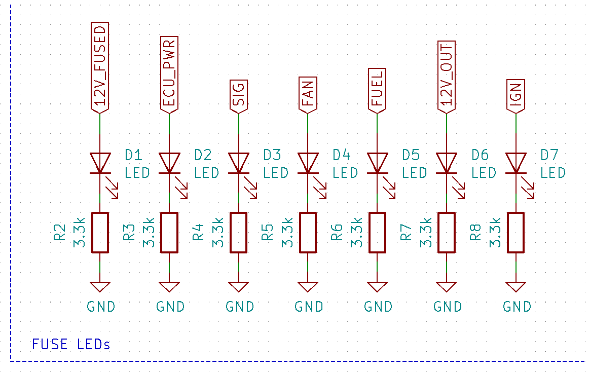

# NU16 Fusebox
Part of the 2020 rebuild of NU16, the fusebox is made from a PCB rather than having a mess of wires everywhere.

## Schematic

### LEDs
These green LEDs are just indicators of whether the fuse is working or not.

